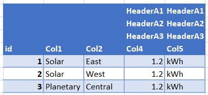
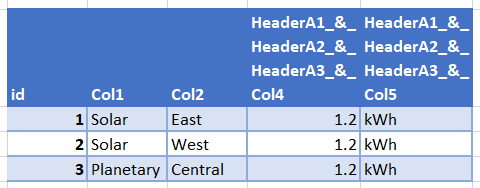
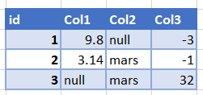
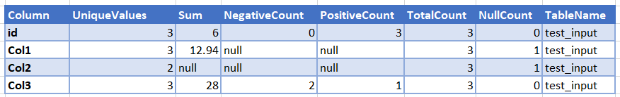
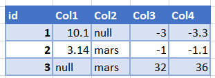
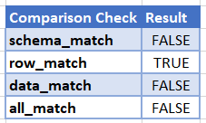
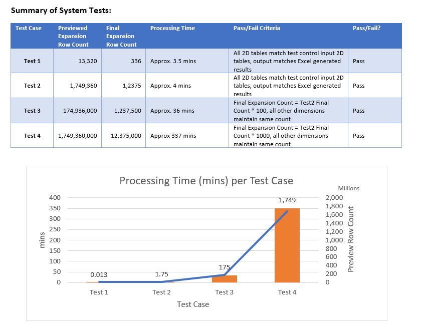

# Utilities
This repository is for development of commonly used tools in routine data processing.

Much of the core functionality was built to run in the Databricks environment using 
built in interfaces for ingestion of data as well as spark, cluster and storage dependecies. 
Future versions may take advantage of the [Databricks CLI](https://pypi.org/project/databricks-cli/) 
to have more use cases for local deployment, outside of the Databricks environment.

#### Requirements: [Official Databricks Runtime](https://docs.databricks.com/en/release-notes/runtime/index.html), [pip](https://pypi.org/project/pip/), [Python](https://www.python.org/downloads/), [requirements.txt](requirements.txt)

#### Source Data/Database: local .csv, Delta Lake - Azure Data Lake Storage

## Quality Control
Quality Control functionality is achieved through methods within the 
QualityControl class with a focus on data manipulation techniques using the 
Databricks environment.

Primary functionality of this class includes:
1. Loading in data from a .csv file and conditioning it for qc measures
2. Generating a summary table of a pyspark dataframe
3. Comparing any two pyspark dataframes

## Unit Testing
Unit tests of the utility classes and methods includes testing of the core 
functionality of each module.
Classes included in current Unit Testing are:
1. QualityControl class - Tests the core functionality over various logical paths and edge cases.

## Use Cases
Conditioning raw data, generating summaries of large tables and comparing any two tables are common quality control steps
and have many use cases. 

* Conditioning a raw input file  
    Given a raw, unstructured .csv file:  
        
    Flatten nested headers and set correct datatype:  
       

* Generating a summary table   
    Create a summary of each field in data table such that given input,   
      
    a summary table is created:  
      
    
* Comparing two tables  
    Given two input tables,  
     and   
    A comparison check is created:  
      

* Performance Testing

    These methods are used as part of a larger performance testing 
    framework that runs analysis steps with known outputs.

    The results of this performance testing are shown below, where a module was ran four 
    seperate times, each time increasing the computational requirements (size) of the data. The quality 
    control functions were used to ensure the data matches the expected results and the processing time 
    was recorded for each Test Case.

    